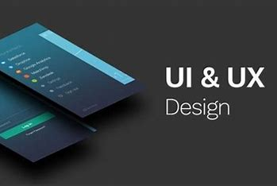

# Portfolio Brief

Hello am Hussam Alraggad, a UX/UI Designer and enthusiast about designing enthralling user experiences that win over hearts. With a sharp mind geared toward software development and a creative flair that knows no bounds, I consistently craft memorable designs that go above and beyond.

## Experience

- 2023 - Present: UX/UI Design Program at [Abdul Aziz Al Ghurair School of Advanced Computing (ASAC)](https://www.linkedin.com/company/asacltuc/mycompany/)

- 2023 - Present: Front-End Web Development at [Abdul Aziz Al Ghurair School of Advanced Computing (ASAC)](https://www.linkedin.com/company/asacltuc/mycompany/)

- 2022 - Present: Front-End Flutter Development for Android at [Udemy](https://www.udemy.com/)

- 2019 - 2023: Software Engineering Bachelor at [The Hashimite University](https://hu.edu.jo/)

## Expertise

I have experience in wireframing, creating eye comforting visual designs, prototyping, and mobile applications and websites development.

## Tools & Languages I Worked With

- Vite, React, TypeScrip: for Frontend Web Development
- HTML, CSS, JavaScrip: for Frontend Web Development
- Miro & Figma: for Wireframing, Visual Design, and Prototyping
- Dart & Flutter: for Frontend Mobile Applications Development (Android)

## My Work

- [GitHub](https://github.com/EngHussam23)
- [Behance](https://www.behance.net/HussamAlraggad)

## Let's connect & collaborate!

- LinkedIn: [Hussam Alraggad](https://www.linkedin.com/in/hussam-al-raggad/)
- Email: [Hussam Alraggad](mailto:egraggad60@gmail.com)
